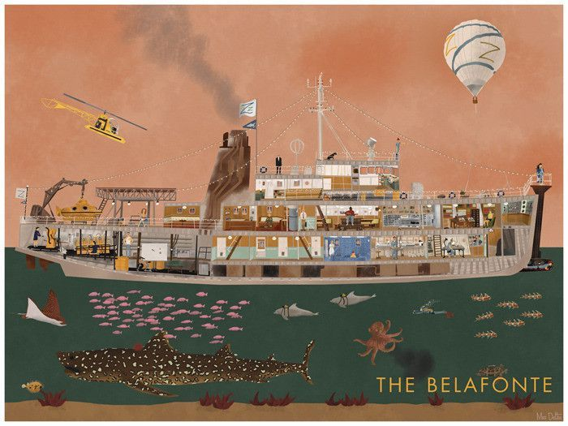
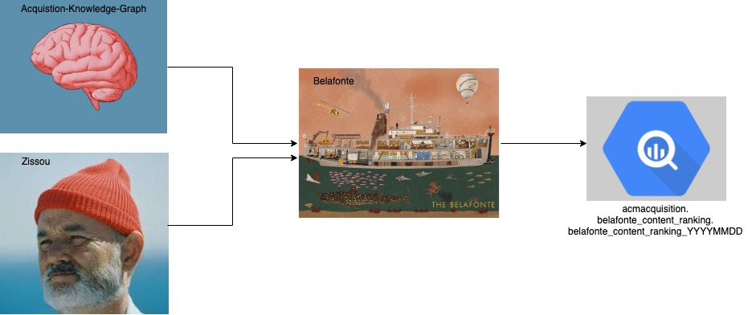
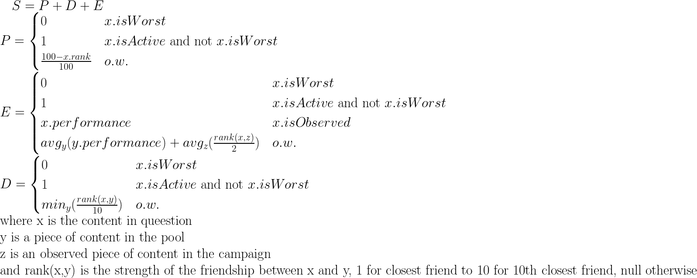

# belafonte-ranker
Maintainer: life-acquatic <life-acquatic-private@spotify.com> #life-acquatic



## Belafonte, ACM Acquisition's Content Ranking Tool

### _What does it mean, in layman's terms?_
This is a pipeline that ingests the content (playlists, artists) that are currently available for
 use in offline marketing.  It then uses this, plus the results of the content already 
 running, to re-rank all content for each market in order to give recommendations on which ads to 
 replace.

### Who invented it?
This is meant to be a heuristic-based, v1 of a content ranker for the purposes of ACM Acquisition
 (a squad called [Life Acquatic](https://backstage.spotify.net/org/life-acquatic), hence the 
 themed system names).  For any further questions, 
 please contact them, or the original author of the heuristic, @nataniaw (dat's me).
 
### What's it doing?
Currently, we have Belafonte running for Facebook/Instagram ads live in thirteen campaigns across 
the 
globe.  We have plans to eventually expand this to all campaigns, as well as multiple platforms 
(Google, er, other stuff...)

## Architecture:
This tool reads the output of two sources, runs a heuristic, and outputs a daily table in Bigquery.
The logic for building the acquisition knowledge graph (content available for use) lives [here](https://ghe.spotify.net/edison/acquistion-knowledge-graph)
(or on [Backstage](https://backstage.spotify.net/components/acquistion-knowledge-graph)) and
 the information on metrics for currently-used content is ingested from a system called [Zissou](https://ghe.spotify.net/edison/zissou)
 (also on [Backstage](https://backstage.spotify.net/components/zissou)).
 Here's a dumb diagram of the inputs/outputs of the system:
 
 
 
## Components:
Belafonte currently uses a heuristic to rank the content. There are several components used to 
deal with content currently live on the platform in a given campaign, content that has already been 
seen, and content that has not yet been used (in that campaign).  Right now, Belafonte operates 
independently -- data from one campaign does not influence any others.

### [Find Worst](https://ghe.spotify.net/edison/belafonte-ranker/blob/documentation-v1/belafonte-ranker/src/main/scala/com/spotify/data/BelafonteContentRanker/BelafonteContentRankerJob.scala#L270)
This is the component, that, given the active ads in a campaign, will pick which one to remove. 
It first disconsiders all ads that have been live less than 5 days, as there is not enough data 
to determine their performance (most platforms, including Facebook, require a few days to find the 
right audience for a piece of content -- what's called a "learning phase").  Of the remaining ones,
 it picks the x ads with the least spend yesterday, where x is determined by the number of 
 running ads.
 
### [Compute Estimated Performance](https://ghe.spotify.net/edison/belafonte-ranker/blob/master/belafonte-ranker/src/main/scala/com/spotify/data/BelafonteContentRanker/BelafonteContentRankerJob.scala#L222)
This is the component that combines observed performance data (fraction of spend given to that 
content) and estimated performance (estimated using observed performance of similar pieces of 
content, defaulted as the average performance over the entire campaign).

### [Compute Score Against Pool](https://ghe.spotify.net/edison/belafonte-ranker/blob/master/belafonte-ranker/src/main/scala/com/spotify/data/BelafonteContentRanker/BelafonteContentRankerJob.scala#L176)
This component computes the score of all remaining non-ranked content compared to the ranked 
content.  It combines its estimated/observed performance in the past, its popularity on
platform, and how different it is from the current pool (calculated by the strength of its links
 to content already in the pool in the input knowledge graph.)
 
### [Fill Out Pool](https://ghe.spotify.net/edison/belafonte-ranker/blob/master/belafonte-ranker/src/main/scala/com/spotify/data/BelafonteContentRanker/BelafonteContentRankerJob.scala#L153)
This component recursively ranks all pieces of content. First, it adds to the pool with maximum 
score all currently-live content that hasn't been deemed "worst" by the [findWorst](###find-worst) 
component.  
Then, it recursively scores the rest of the content against the pool, picks the one with the max 
score to add to the pool, and repeats the process until all content has been scored/ranked.

## Heuristic Explanation
In its current state, the "score" of each piece of content (in each campaign) is always 
calculated by a heuristic, which compares that piece of content to the already-running content to
 determine its potential performance, popularity, and diversity.  For a boy-band-themed 
 lunch and learn presentation on the heuristic, please see [this link](https://docs.google.com/presentation/d/1AOX_ns04o7w3V931xiJ4PdkMhkBKvNOQgtNvsB0g8Mg/edit?usp=sharing)
 and if you don't feel like that but you love math/symbols, just see below formula: 
 
 
  
  
  
Thus, the maximum score a non-active piece of content can have is 2.99, and the minimum score is 
0.1.

## To make a change in the pipeline:

This runs like a normal scio pipeline, so all development follows the normal process.

To make a change to this pipeline:
 * implement logic of your pipeline (in scala)
 * implement the scheduling/dependencies of your pipeline (in luigi_tasks)
 * implement test for your logic (in scala.test)
 * manually run your pipeline (via sbt/IDE)
 * manually run your pipeline using luigi
 * review changes your data-info.yaml file, luigi tasks etc
 * let Tingle handle automated deployments and schedule through Styx

## Development

### Setup

For development, install Scala, SBT and Docker.

### Building, Testing, Verifying and Packaging

#### Python

```sh
$ docker run --rm -i -w $(pwd) -v $(pwd):$(pwd) gcr.io/action-containers/tox:3.7.0-3 -c tox.ini
```

This will run Python style check, tests, coverage checks and reports. Please refer to [this page](https://ghe.spotify.net/action-containers/tox)
for latest version and usage of `tox` action-container.

Alternatively, you can install and run `tox` locally:

```sh
$ pip install tox
$ tox
```

The following frameworks and tools are used for Python unit test:

* [pytest](https://pytest.org/)
* [coverage](https://github.com/nedbat/coveragepy)
* [flake8](http://flake8.pycqa.org/en/latest/)
* [mock](https://docs.python.org/3/library/unittest.mock.html)

[black](https://github.com/ambv/black) is recommended to format Python code automatically.

#### Scala

```sh
$ sbt clean verify docker
```

This will run Scala tests, coverage checks and reports, and create the docker image.

### Run Scio/Dataflow with SBT locally

For running the job locally using `sbt runMain` target, follow https://ghe.spotify.net/scala/scio-cookie#sbt .

### Run on docker locally

Follow instructions from [quick-styx](https://ghe.spotify.net/datainfra/quick-styx).

## Documentation


---

This project is based on the [scio-cookie template](https://ghe.spotify.net/scala/scio-cookie)

---

```
Copyright (c) 2019 Spotify AB

THIS REPOSITORY IS THE PROPERTY OF SPOTIFY AB
UNAUTHORIZED ACCESS TO THIS DATA IS STRICTLY PROHIBITED.
```

[Scheduling a Workflow with Styx]: https://confluence.spotify.net/display/DI/Scheduling+a+Workflow
